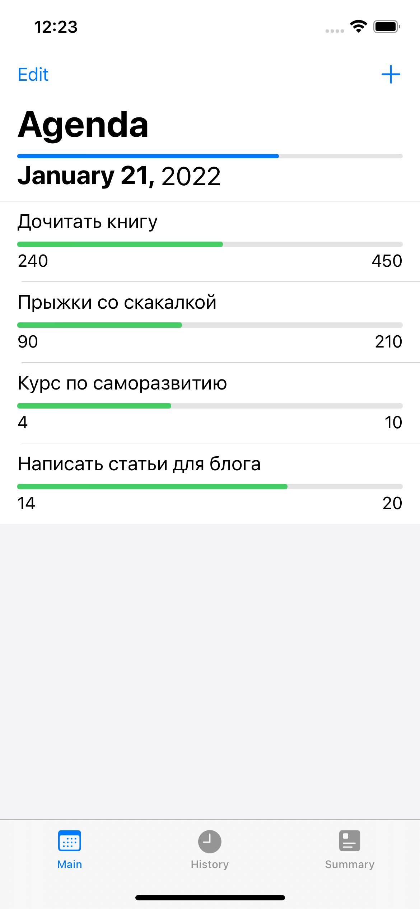
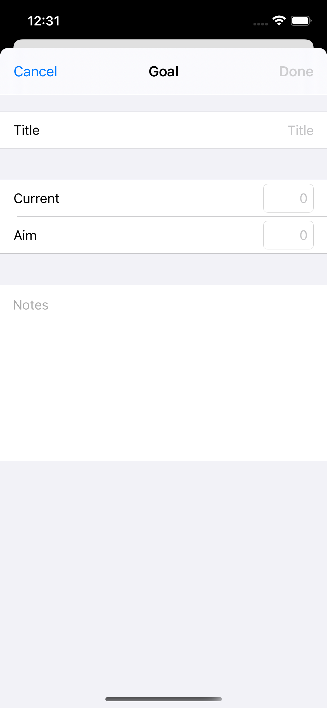
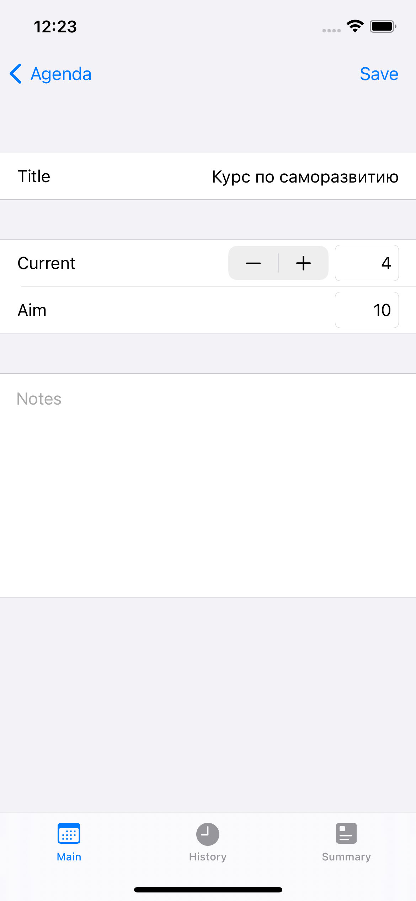
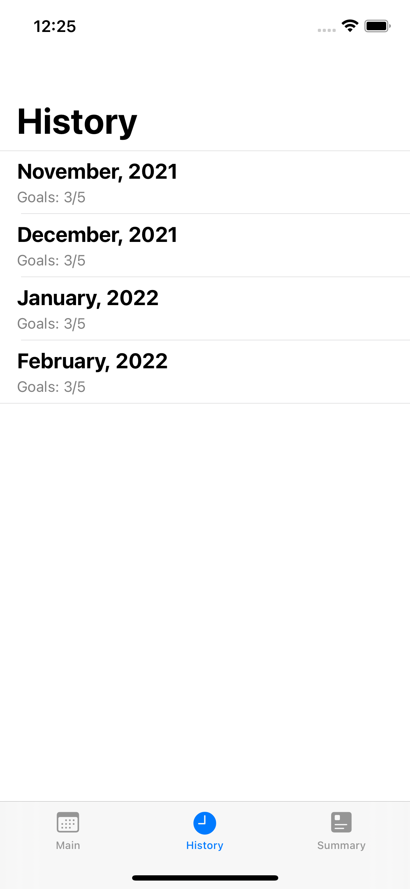
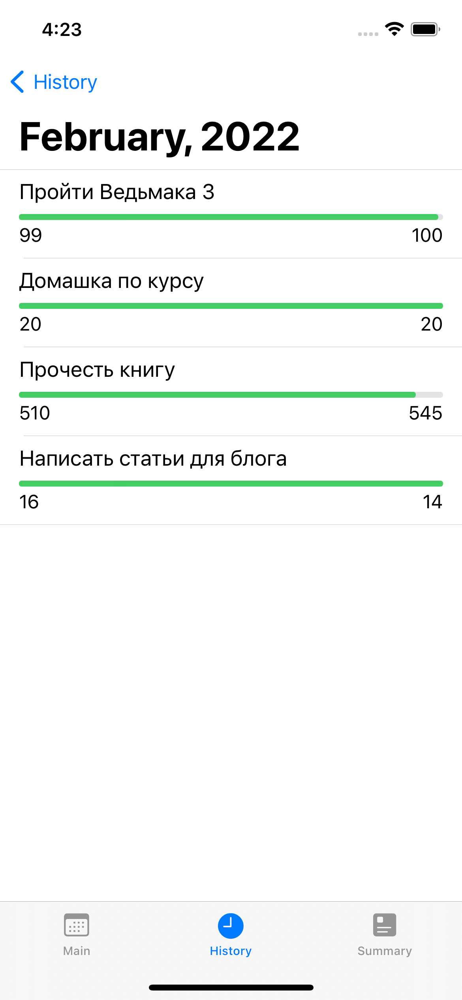
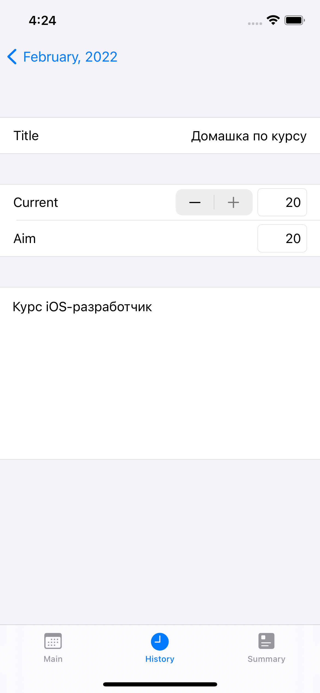

#  Agenda
Application that allows you to track your goals for a month

# Demo (now screenshots only)

# Description
My first independent UIKit learning project. In this project, I demonstrated the knowledge:
1. UIKit
2. CoreData
3. Human Interface Guidelines
4. MVC Architecture

# Requirements
- Minimum version: iOS 13
- For permanent data storage, you need to use Core Data
- No storyboard is allowed
- The interface is drawn in UIKit
- The app looks correct for iPhone SE (1st gen.) and above
